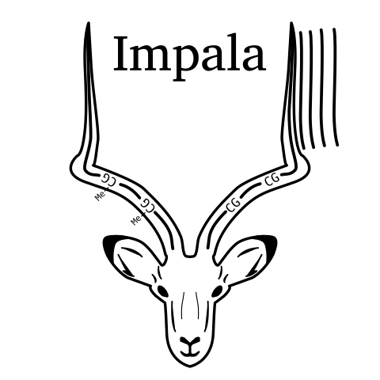
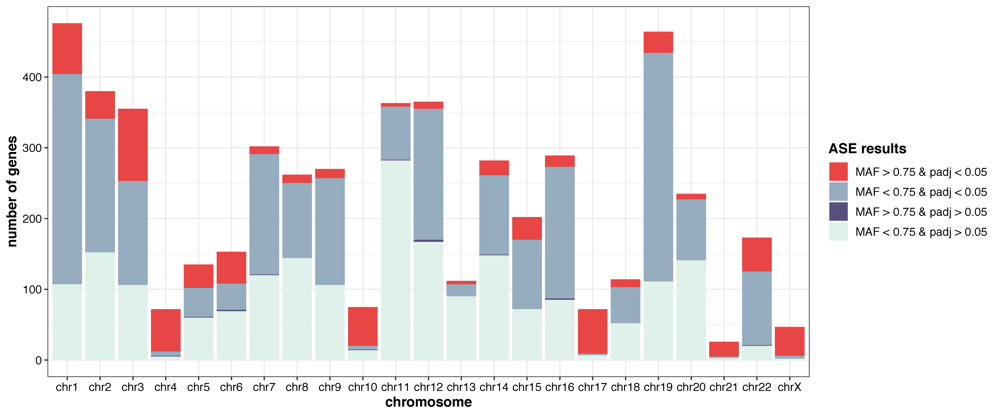
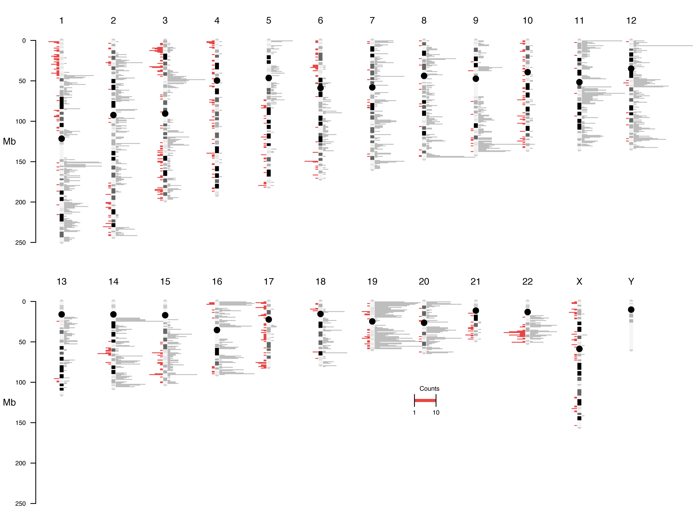
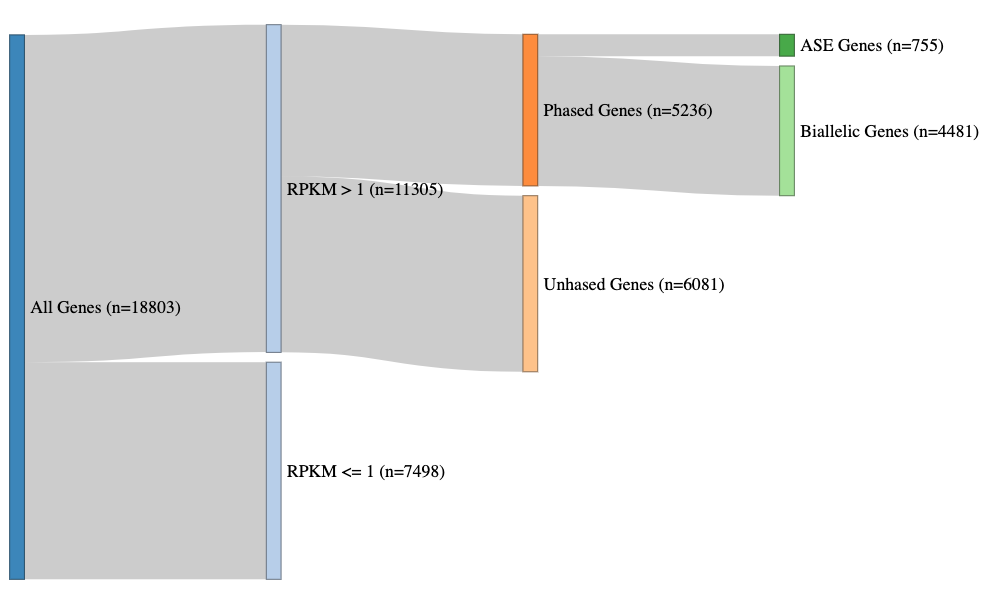

# Integrated Mapping and Profiling of Allelically-expressed Loci with Annotations 
[](https://github.com/bcgsc/IMPALA/actions/workflows/run_snakemake.yaml)



This workflow outputs the allele-specific expression using short-read RNA-seq. The phasing information of the variants from tools such as WhatsApp can be provided to increase the performance of the tool. Copy number variant data and allelic methylation data can also be provided to analyze genes with allele specific expression.

# Install
Clone the repository:

```
git clone https://github.com/bcgsc/IMPALA.git
```

You must have snakemake and singularity (or Docker) installed to run the workflow. All steps within the workflow specify Docker containers, so require no installation. 

# Input

### **Method one**: RNA reads: <br />
- RNA paired end reads (R1 & R2 fastq file)

### **Method two**: RNA alignment: <br />
- RNA alignment alignment (bam file)
- Expression Matrix 
    - Expression in RPKM/TPM
    - Gene name must be in HGNC format
    - Column name is "Gene" and sample names

### **Optional Input for both methods:**
- Phase VCF
    - Only needed if **phased option** in parameter.yaml is True   
    - Can be obtained using [WhatsHap](https://github.com/whatshap/whatshap/) with DNA long reads
    - Significantly improves precision of ASE calling
    - Adds TFBS mutation and stop gain/loss information to summary table if **cancer_analysis option** is True
 - Copy Number Variant Data
    - Only used if **cancer_analysis option** in parameter.yaml is True 
    - Can be optained using [ploidetect](https://github.com/lculibrk/Ploidetect)
    - Intersect ASE gene with allelic copy number imbalance regions
- Allelic Methylation
    - Only used if **cancer_analysis option** in parameter.yaml is True 
    - Can be optained using [NanoMethPhase](https://github.com/vahidAK/NanoMethPhase)
    - Use to intersect ASE gene with allelic methylation in promoter region
- Somatic mutations
    - Only used if **cancer_analysis option** in parameter.yaml is True
    - Finds somatic mutations in ASE gene and promoters
- Tumor Content
    - Used to calcualte the expected Major Allele Frequency 
    - Assumes 1.0 if not specified
- Tissue type
    - Only used if **cancer_analysis option** in parameter.yaml is True
    - Include data for average MAF in normal tissue in summary table
    - Otained from GTex database which ran [phASER](https://genomebiology.biomedcentral.com/articles/10.1186/s13059-020-02122-z) to calcualte allelic expression 
    - <ins>Possible options</ins>: allTissue, Adipose, Adrenal_gland, Bladder, Blood, Brain, Breast, Cervix, Colon, Esophagus, Fallopian_tube, Heart, Kidney, Liver, Lung, Muscle, Nerve, Ovary, Pancreas, Pituitary, Prostate, Salivary, Skin, Small_intestine, Spleen, Stomach, Testis, Thyroid, Uterus, Vagina


# **Output**
All output and intermediary files is found in `output/{sample}` directory. The workflow has four main section, alignment, variant calling, mbased and cancer analysis. Files from each steps are found in the corrospinding folder within `output/{sample}`. The key outputs from the workflow is located below

1. MBASED related outputs (found in `output/{sample}/mbased`)
    - The tabular results of the output `MBASED_expr_gene_results.txt`
    - The rds object of the MBASED raw output `MBASEDresults.rds`
2. Summary table of all outputs
    - Found in `output/{sample}/summaryTable.tsv`
    - Data of all phased genes with ASE information along with copy number variant and allelic methylation information if avalble
3. Figures 
    - Found in `output/{sample}/figures`
    - Example figure shown below

## **Summary Table Description**
| Column               | Description                                                                            | 
| :---                 |    :----:                                                                              |  
| gene                 | HGNC gene symbol                                                                       | 
| Expression           | Expression level                                                                       | 
| allele1IsMajor       | T/F if allele 1 is the major allele (allele 1 = HP1)                                   | 
| majorAlleleFrequency | Major allele frequency                                                                 | 
| padj                 | Benjamini-Hochberg adjusted pvalue                                                     | 
| aseResults           | ASE result based on MAF threshold (and pval)                                           | 
| cnv.A*               | Copy Number for allele 1                                                               |
| cnv.B*               | Copy Number for allele 2                                                               |
| expectedMAF*         | Expect Major Allele Frequency based on CNV                                             |
| cnv_state*           | Allelic CNV state (Loss of Heterozygosity, Allelic balance/imbalabnce)                 |
| methyl_state**       | Methylation difference in promter region (Allele 1 - Allele 2) |
| tf_allele***         | Allele where there is gain of transcription factor binding site                        |
| transcriptionFactor***| Transcription Factor for gain TFBS                                                     |
| stop_variant_allele***| Allele where stop gain/stop loss variant is found                                      |
| somaticSNV****       | Somatic SNV found in (or around) gene (T/F)                                            |
| somaticIndel****     | Somatic Indel found in (or around) gene (T/F)                                          |
| normalMAF*****       | Add MAF for gene in normal tissue                                                      |
| cancer_gene          | T/F if gene is a known cancer gene (based on `annotation/cancer_gene.txt`)             |
| sample               | Sample Name                                                                            |

\* Only included if CNV data is provided

\** Only included if methylation data is provided

\*** Only included if phased vcf is provided

\**** Only included if somatic snv and indel is provided

\***** Only included if tissue type is specified

# Running samples

## **Edit the config files**

parameters.yaml: <br />
- Choose a **genome** to use (hg38/hg19/hg38_no_alt_TCGA_HTMCP_HPVs)
- Specify the path to the **RPKM matrix** that contains the sample (can include multiple samples but sample id must be in the column names)
- Specify **MAF threshold** and **threads**
- Choose to include **phasing** data (need to provide phased VCF) 
- Choose to do **cancer_analysis** (need to provide CNV and methylation data)
- Add paths to SNPeff **annotation file**
- Add paths to STAR and RSEM **reference files** (only needed if cancer_analysis is True)

samples.yaml: <br />
- Make sure to name the sample(s) the same identifier as the matching RPKM matrix column name
- Add the paths to the **RNA-seq Illumina bam files** or **RNA R1 and R2 illumina reads**
- Add paths to **phase VCF** (needed if phase = True)
- Add paths to **CNV and allelic methylation data** (needed if cancer_analysis = True)


## **Run snakemake**
You can choose the number of max threads to use with `-c`. This is the command to run it with singularity:

```
snakemake -c 30 --use-singularity --singularity-args "-B /projects,/home,/gsc"
```

The following command is for running the workflow with conda:

```
snakemake -c 30 --use-conda 
```

# Figure Outputs 

### aseGenesDot
The `aseGenesDot.pdf` figure shows the MAF and padj for each phased gene. The red dots (MAF > 0.75 & padj < 0.05) are the ASE genes. 


### aseGenesBar
The `aseGenesBar.pdf` figure shows the number of genes that fall into the statistical cut offs across each chromosome. The red variable (MAF > 0.75 & padj < 0.05) are the ASE genes. The remaining genes are coloured by where they fall in the MAF and padj cut-offs. 



### chromPlot
The `chromPlot.pdf` figure shows the distribution of ASE genes by their genomic location. The ASE genes are in red facing left, while the biallelic genes (all genes that don't make the padj and MAF cut offs) are in grey facing right. 



### sankeyPlot
The `sankeyPlot.html` shows how many of genes made it through each filtering step. All genes included only the genes labeled as protein coding, lincRNA, or miRNA.  They were filtered by (1) expression level, (2) ablity to be phased, and (3) whether or not they have ASE.


