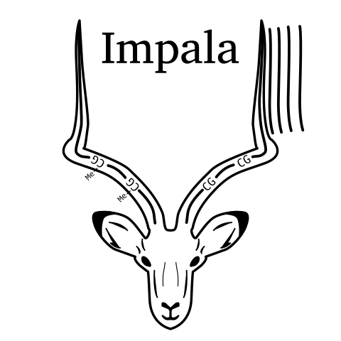
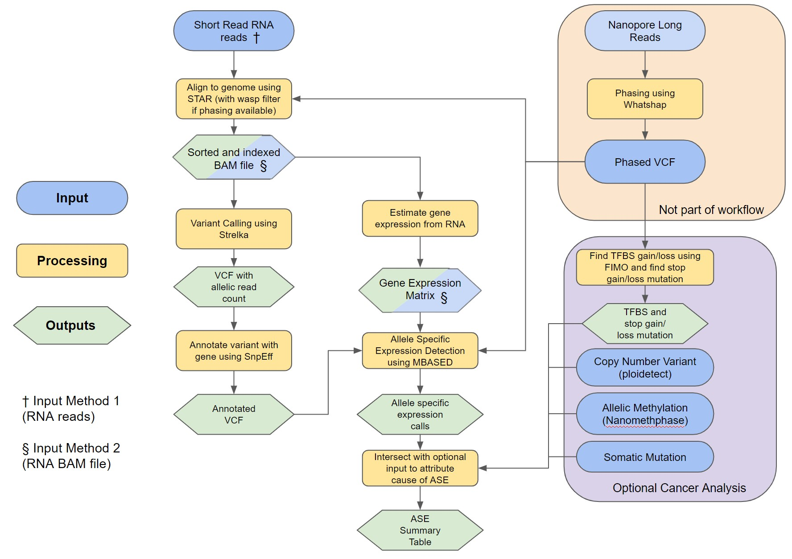

# Integrated Mapping and Profiling of Allelically-expressed Loci with Annotations 
[](https://zenodo.org/badge/latestdoi/590257376)
[](https://github.com/bcgsc/IMPALA/actions/workflows/run_snakemake.yaml)
[](https://snakemake.readthedocs.io)

This Snakemake workflow calls allele-specific expression genes using short-read RNA-seq. Phasing information derived from long-read data by tools such as WhatsHap can be provided to increase the performance of the tool, and to link results to features of interest. Copy number variant data, allelic methylation data and somatic variant data can also be provided to analyze genes with allele specific expression.


Table of Contents
=================

* **[Overall Workflow](#overall-workflow)**
* **[Installation](#installation)**
  * [Dependencies](#dependencies)
* **[Input Files](#input-files)**
  * [Optional input](#optional-inputs)
* **[Running Workflow](#running-workflow)**
  * [Edit config file](#edit-the-config-files)
  * [Running snakemake workflow](#run-snakemake)
* **[Output Files](#optional-inputs)**
  * [Summary Output](#summary-table-description)
  * [Example Figures](#example-figures)
* **[Contributors](#contributors)**
* **[License](#license)**


# Overall Workflow


<br>

# Installation
This will clone the repository. You can run the IMPALA within this directory.
```
git clone https://github.com/bcgsc/IMPALA.git
```

### Dependencies
> To run this workflow, you must have snakemake (v6.12.3) and singularity (v3.5.2-1.1.el7). You can install snakemake using [this guide](https://snakemake.readthedocs.io/en/stable/getting_started/installation.html) and singularity using [this guide](https://docs.sylabs.io/guides/3.5/admin-guide/installation.html). The remaining dependencies will be downloaded automatically within the snakemake workflow.

# Input Files

### **Method 1**<sup>†</sup>: RNA reads: <br />
- RNA paired end reads (R1 & R2 fastq file)

### **Method 2**<sup>§</sup>: RNA alignment: <br />
- RNA alignment alignment (bam file)
- Expression Matrix 
    - Expression in RPKM/TPM
    - Gene name must be in HGNC format
    - Column name is "Gene" and sample names


### **Optional Inputs:**
- Phase VCF
    - Can be obtained using [WhatsHap](https://github.com/whatshap/whatshap/) with DNA long reads
    - Significantly improves precision of ASE calling
    - Adds TFBS mutation and stop gain/loss information 
 - Copy Number Variant Data
    - Can be optained using [ploidetect](https://github.com/lculibrk/Ploidetect)
- Allelic Methylation
    - Can be optained using [NanoMethPhase](https://github.com/vahidAK/NanoMethPhase)
- Somatic mutations
    - Finds somatic mutations in ASE gene and promoters
- Tumor Content
    - Used to calcualte the expected major allele frequency 
    - Assumes 1.0 if not specified
- Tissue type
    - Include data for average MAF in normal tissue in summary table
    - Otained from GTex database which ran [phASER](https://genomebiology.biomedcentral.com/articles/10.1186/s13059-020-02122-z) to calcualte allelic expression 

# Running Workflow

### **Edit the config files**

#### **Example parameters.yaml:** <br />
Config files to specify parameters and paths needed for the workflow. The main parameter to include is the genome name, path to expression matrix, major allele frequency threshold and threads as well as settings for using phased vcf and doing cancer analysis.
```
# genome_name should match bams
genome_name: hg38/hg19/hg38_no_alt_TCGA_HTMCP_HPVs

# RPKM matrix of the samples
matrix: /path/to/expression/matrix.tsv

# Major allele frequency threshold for ASE (0.5 - 0.75)
maf_threshold: 0.65

# Threads for STAR, RSEM, Strelka and MBASED
threads: 72

# Use phased vcf (True or False)
# Uses pseudphasing algorithm if False
phased: True

# Perform cancer analysis 
# Intersect with optional input
cancer_analysis: True


# Paths for annotation
annotationPath:
    snpEff_config:
        /path/to/snpEff/config
    snpEff_datadir:
        /path/to/snpEff/binaries/data
    snpEff_genomeName:
        GRCh38.100
    snpEff_javaHeap:
        64g

# Paths for references
# Only needed if RNA read is provided instead of RNA bam
starReferencePath:
    /path/to/star/ref
rsemReferencePath:
    /path/to/rsem/ref
```
#### **Example samples.yaml:** <br />
Main config file to specify input files. For input method 1 using R1 and R2 fastq file, use `R1` and `R2` tag. For input method 2 using RNA bam file, use  `rna` tag. All other tags are optional.

```
samples:
    # Sample Name must match expression matrix
    sampleName_1: # Method 1
        R1:
            /path/to/RNA/R1.fq
        R2:
            /path/to/RNA/R2.fq
        somatic_snv:
            /path/to/somatic/snv.vcf
        somatic_indel:
            /path/to/somatic/indel.vcf
        tissueType:
            Lung
    sampleName_2: # Method 2
        rna:
            /path/to/RNA/alignment.bam
        phase:
            /path/to/phase.vcf.gz
        cnv:
            /path/to/cnv/data
        methyl:
            /path/to/methyl/data.bed
        tumorContent:
            0.80
```


#### **Example defaults.yaml:** <br />
Config file for specify path for reference genome, annotation bed file and centromere bed file. Annotation and centromere bed file for hg38 are included in the repository.

```
genome:
    hg19:
        /path/to/hg19/ref.fa
    hg38:
        /path/to/hg38/ref.fa
    hg38_no_alt_TCGA_HTMCP_HPVs:
        /path/to/hg38_no_alt_TCGA_HTMCP_HPVs/ref.fa

annotation:
    hg19:
        /path/to/hg19/annotation.fa
    hg38:
        annotation/biomart_ensembl100_GRCh38.sorted.bed  
    hg38_no_alt_TCGA_HTMCP_HPVs:
        annotation/biomart_ensembl100_GRCh38.sorted.bed

centromere:
    hg19:
        /path/to/hg19/centromere.bed
    hg38:
        annotation/hg38_centromere_positions.bed
    hg38_no_alt_TCGA_HTMCP_HPVs:
        annotation/hg38_centromere_positions.bed
```


### **Run snakemake**
This is the command to run it with singularity. The `-c` parameter can be used to specify maximum number of threads. The `-B` parameter is used to speceify paths for the docker container to bind. 

```
snakemake -c 30 --use-singularity --singularity-args "-B /projects,/home,/gsc"
```
# Output Files
All output and intermediary files is found in `output/{sample}` directory. The workflow has four main section, alignment, variant calling, mbased and cancer analysis and their outputs can be found in the corrosponding directories. The key outputs from the workflow is located below

1. MBASED related outputs (found in `output/{sample}/mbased`)
    - The tabular results of the output `MBASED_expr_gene_results.txt`
    - The rds object of the MBASED raw output `MBASEDresults.rds`
2. Summary table of all outputs
    - Found in `output/{sample}/summaryTable.tsv`
    - Data of all phased genes with ASE information along potential causes based on optional inputs
3. Figures 
    - Found in `output/{sample}/figures`
    - Example figure shown below


## **Summary Table Description**
| Column               | Description                                                                            | 
| :---                 |    :----:                                                                              |  
| gene                 | HGNC gene symbol                                                                       | 
| Expression           | Expression level                                                                       | 
| allele1IsMajor       | T/F if allele 1 is the major allele (allele 1 = HP1)                                   | 
| majorAlleleFrequency | Major allele frequency                                                                 | 
| padj                 | Benjamini-Hochberg adjusted pvalue                                                     | 
| aseResults           | ASE result based on MAF threshold (and pval)                                           | 
| cnv.A<sup>1</sup>               | Copy Number for allele 1                                                               |
| cnv.B<sup>1</sup>              | Copy Number for allele 2                                                               |
| expectedMAF<sup>1</sup>         | Expect Major Allele Frequency based on CNV                                             |
| cnv_state<sup>1</sup>           | Allelic CNV state (Loss of Heterozygosity, Allelic balance/imbalabnce)                 |
| methyl_state<sup>2</sup>       | Methylation difference in promter region (Allele 1 - Allele 2) |
| tf_allele<sup>3</sup>         | Allele where there is gain of transcription factor binding site                        |
| transcriptionFactor<sup>3</sup> | Transcription Factor for gain TFBS                                                     |
| stop_variant_allele<sup>3</sup> | Allele where stop gain/stop loss variant is found                                      |
| somaticSNV<sup>4</sup>        | Somatic SNV found in (or around) gene (T/F)                                            |
| somaticIndel<sup>4</sup>      | Somatic Indel found in (or around) gene (T/F)                                          |
| normalMAF<sup>5</sup>        | Add MAF for gene in normal tissue                                                      |
| cancer_gene          | T/F if gene is a known cancer gene (based on `annotation/cancer_gene.txt`)             |
| sample               | Sample Name                                                                            |

Columns only included if optional input is included:

<sup>1</sup> Copy number variant
<sup>2</sup> Allelic methylation 
<sup>3</sup> Phased vcf 
<sup>4</sup> Somatic SNV and Indel
<sup>5</sup> Tissue type

# Example Figures

Several figures are automatically generate based on the optional inputs. They can be found in `output/{sample}/figures`. The main figure is `karyogram.pdf` which show co-locationzation of ASE genes with allelic methylation and somatic copy number alteration. Example figures can be found [here](res/exampleFigure.md). 


# Contributors
The contributors of this project are
Glenn Chang, Vannessa Porter, and Kieran O'Neill.

<a href="https://github.com/bcgsc/IMPALA/graphs/contributors">
  
</a>

# License

`IMPALA` is licensed under the terms of the [GNU GPL v3](LICENSE).

[](https://www.gnu.org/licenses/gpl-3.0)

