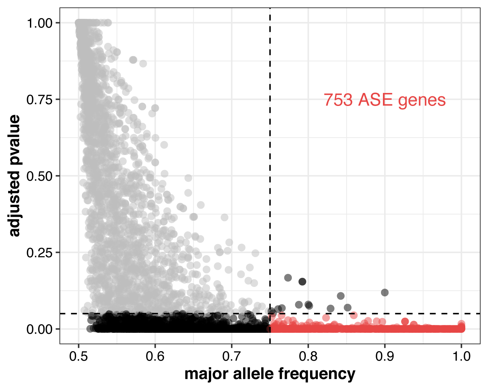
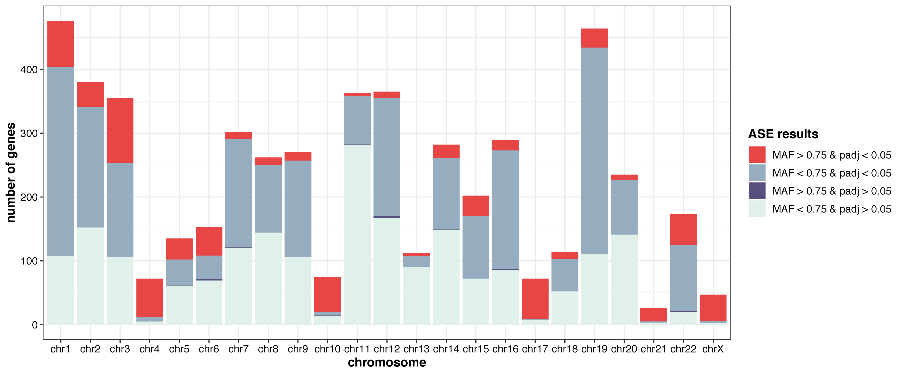
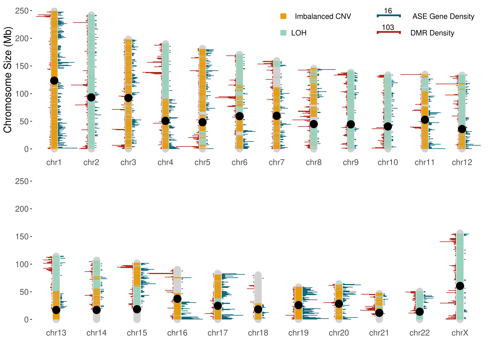
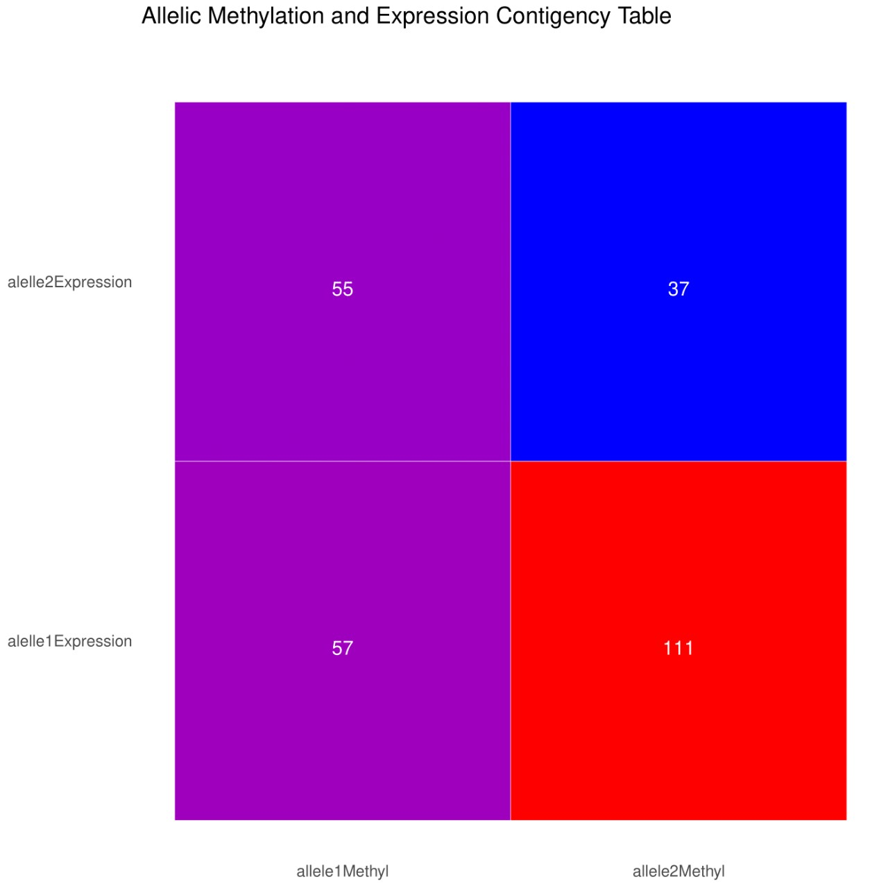
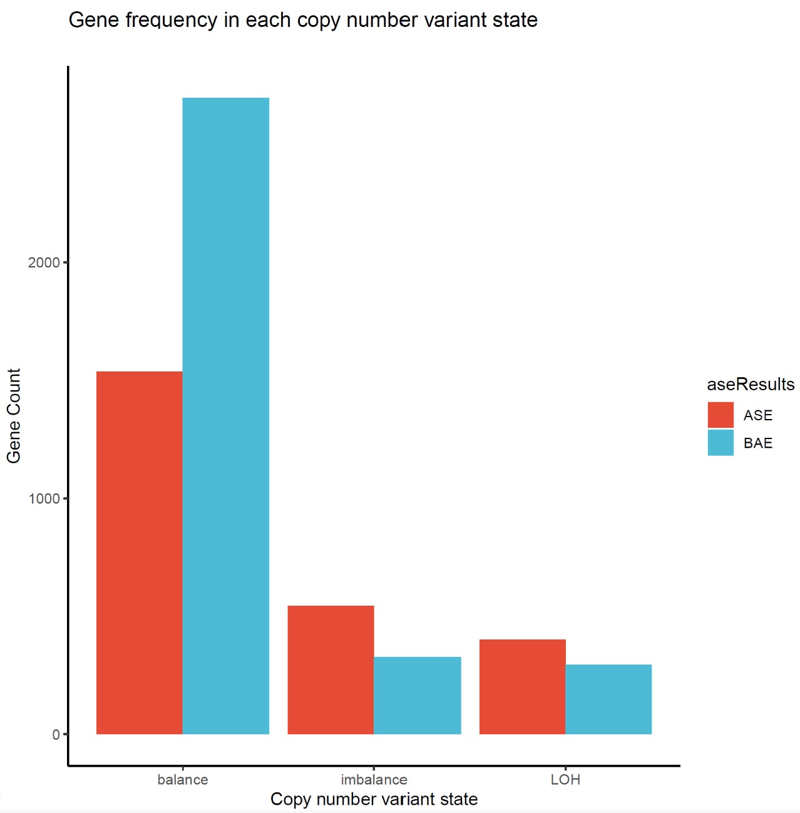
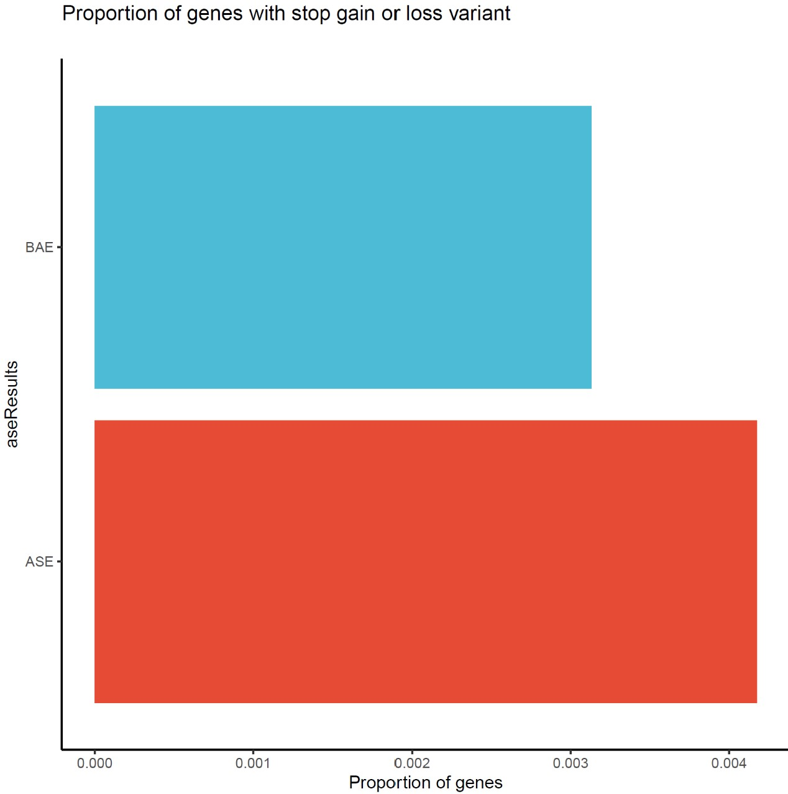
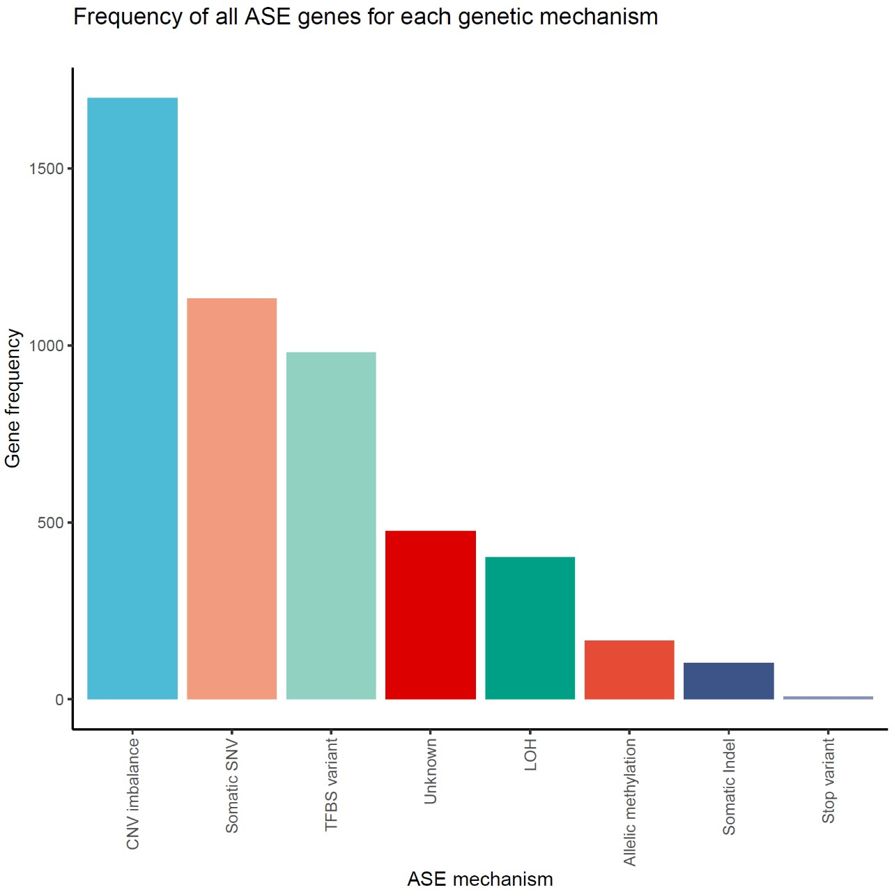

# Example figures for IMPALA
These are example figures generated from the IMPALA workflow. Some figures will only be generated if the corrosponding optional inputs are provided. These could be found in `output/{sample}/figures` directory.

 

## **aseGenesDot**
The `aseGenesDot.pdf` figure shows the MAF and padj for each phased gene. The red dots are the ASE genes. Major allele threshold is specified in `parameter.yaml` file.

 

## **aseGenesBar**
The `aseGenesBar.pdf` figure shows the number of genes that fall into the statistical cut offs across each chromosome. The red variable (MAF > 0.75 & padj < 0.05) are the ASE genes. The remaining genes are coloured by where they fall in the MAF and padj cut-offs. 

 

## **karyogram**
The `karyogram.pdf` figure shows the distribution of ASE genes by their genomic location along with allelic methylation data and copy number variant data if avalible. 

 

## **sankeyPlot**
The `sankeyPlot.html` shows how many of genes made it through each filtering step. All genes included only the genes labeled as protein coding, lincRNA, or miRNA.  They were filtered by (1) expression level, (2) ablity to be phased, and (3) whether or not they have ASE.

 

## **Contigency Table**
The `dmrContigency.pdf` and `stopVarContingency.pdf` figures show a 2x2 matrix for number of genes for each allele. It illustrates the correlation between major expression allele with the allele with methylation or stop variant. Only generated if the corrosponding optional input was included.

 

## **cnvBar**
The `cnvBar.pdf` figures shows the number of ASE and BAE genes for each CNV state. Only generated if CNV data is avalible. 

 

## **Bar Chart**
The `cancerBar.pdf`, `somaticSNVbar.pdf`,`somaticIndelBar.pdf`, `stopVarBar.pdf`, `tfbsBar.pdf` figures shows the proportion of ASE vs BAE genes that contain those genomic features. Each figure is only generated if the corrosponding optional input was included. 

 

## **ASE cause** 
The `aseCause.pdf` and `cancerCause.pdf` figures show the number of ASE genes (and ASE cancer genes) that can be explained by CNV, allelic methylation, TFBS mutation, stop variant or somatic mutation. The bars depend on if the optional input was included.

